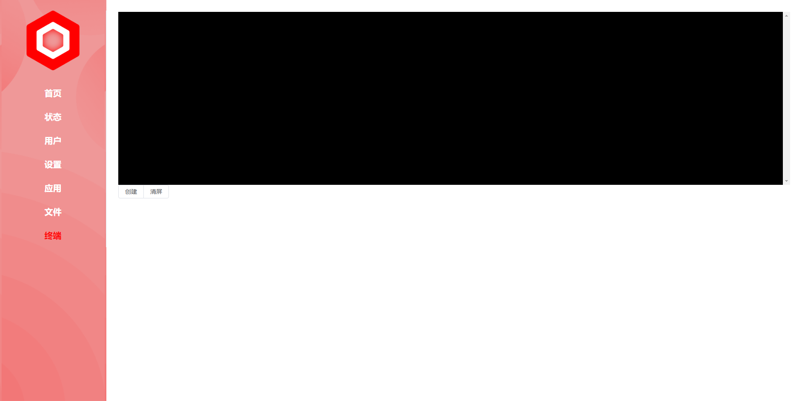
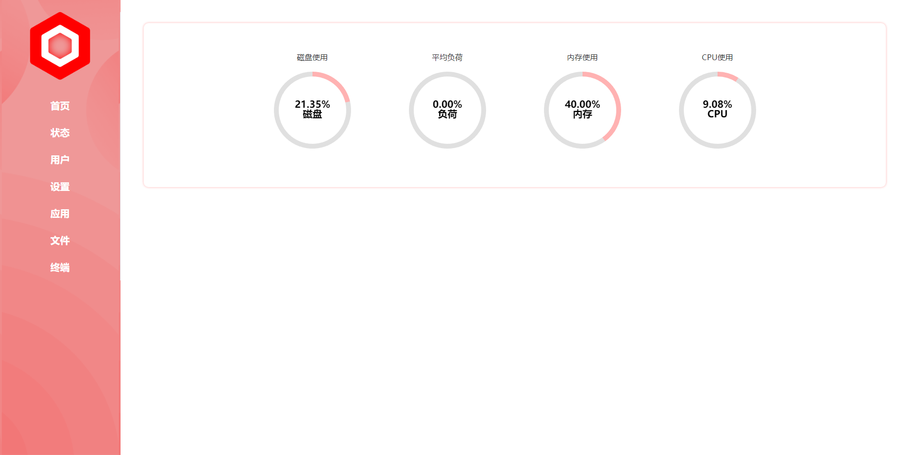
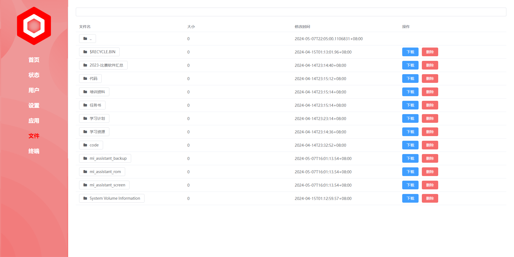

<h1 align="center">
  
  <br>LoongPanel<br>
</h1>

<h4 align="center">一个 LoongArch64 下的运维管理平台</h4>
    
<p align="center">
    
    
    
    
    
    
</p>

# 后端
## 主要功能

- [x] ~~性能监控~~
- [x] ~~文件管理~~
- [ ] 集群管理
- [ ] 日志管理
- [ ] 应用安装
- [ ] 告警通知
- [ ] 漏洞扫描
- [x] ~~远程终端~~
- [ ] 进程管理
- [ ] 垃圾清理
- [ ] 系统设置
- [ ] 面板设置

## 高级功能
- [ ] SSH 管理
- [ ] 数据库管理
- [ ] Docker 管理
- [ ] 定时任务执行
- [ ] 运行环境管理
- [ ] 多用户权限管理

## 构建
> 需要先构建前端获得dist目录
```shell
cd 项目路径/
go get
go mod tidy
go build
```

# 前端
使用 Vue + Element Plus 开发
位置在 `项目路径/Panel/Front/LoongPanel`

## 构建
```shell
cd 项目路径/Panel/Front/LoongPanel
npm install
npm run build
```

# 效果图

---

---

---

# TODO 开发计划

- [ ] 持久化记录
  - [ ] 开关
  - [ ] 时长
  - [ ] 位置
  - [ ] 清理